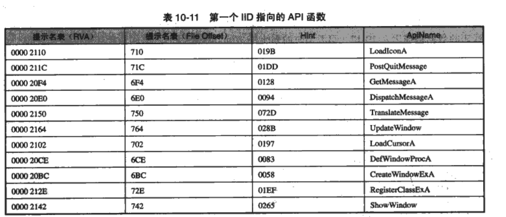
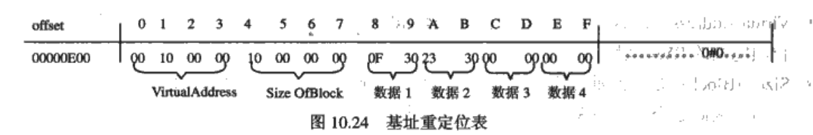

第五篇  系统篇

### 第十章  PE文件格式

- 主要文件：`winnt.h -> image format`

- PE布局

  

#### 10.1  PE的基本概念

- 磁盘文件偏移和内存偏移的转换

  

##### 10.1.1  基地址

- 模块：加载到内存中的PE文件被称为模块

- 模块句柄（hModule）：映射文件的起始地址，这个初始内存地址也称作基地址（ImageBase）

- 访问DLL文件,得到指针：

  ```c
  HMODULE GetModuleHandle(LPCTSTR lpModuleName);
  ```

##### 10.1.2  相对虚拟地址

相对地址（RVA）：内存中，相对于ImageBase的偏移

```
目标地址401000h - 装入地址 400000h = RVA 1000h
```

> 虚拟地址(VA) = 基地址（Image Base） + 相对虚拟地址（RVA）

##### 10.1.3  文件偏移地址

FileOffset/RawOffset:PE文件存储在磁盘上时，相对于文件头的偏移，起始值时0

#### 10.2  MS-DOS头部 

`DOS头部 = DOS MZ 头 + DOS stub`

```c
typedef struct _IMAGE_DOS_HEADER {      // DOS .EXE header
    WORD   e_magic;                     // Magic number
    WORD   e_cblp;                      // Bytes on last page of file
    WORD   e_cp;                        // Pages in file
    WORD   e_crlc;                      // Relocations
    WORD   e_cparhdr;                   // Size of header in paragraphs
    WORD   e_minalloc;                  // Minimum extra paragraphs needed
    WORD   e_maxalloc;                  // Maximum extra paragraphs needed
    WORD   e_ss;                        // Initial (relative) SS value
    WORD   e_sp;                        // Initial SP value
    WORD   e_csum;                      // Checksum
    WORD   e_ip;                        // Initial IP value
    WORD   e_cs;                        // Initial (relative) CS value
    WORD   e_lfarlc;                    // File address of relocation table
    WORD   e_ovno;                      // Overlay number
    WORD   e_res[4];                    // Reserved words
    WORD   e_oemid;                     // OEM identifier (for e_oeminfo)
    WORD   e_oeminfo;                   // OEM information; e_oemid specific
    WORD   e_res2[10];                  // Reserved words
    LONG   e_lfanew;                    // File address of new exe header
  } IMAGE_DOS_HEADER, *PIMAGE_DOS_HEADER;
```

- e_magic：MZ
- e_lfanew: PE头的真正偏移量

#### 10.3  PE文件头 

`PNETHeader = ImageBase + dosHeaser->e_lfanew`

```c
typedef struct _IMAGE_NT_HEADERS {
    DWORD Signature;
    IMAGE_FILE_HEADER FileHeader;
    IMAGE_OPTIONAL_HEADER32 OptionalHeader;
} IMAGE_NT_HEADERS32, *PIMAGE_NT_HEADERS32;
```


##### 10.3.1  Signature字段

作用：用来验证该文件是否时PE文件

```c
#define IMAGE_NT_SIGNATURE                  0x00004550  // PE00
```

##### 10.3.2  IMAGE_FILE_HEADER结构

```c
typedef struct _IMAGE_FILE_HEADER {
    WORD    Machine;
    WORD    NumberOfSections;
    DWORD   TimeDateStamp;
    DWORD   PointerToSymbolTable;
    DWORD   NumberOfSymbols;
    WORD    SizeOfOptionalHeader;
    WORD    Characteristics;
} IMAGE_FILE_HEADER, *PIMAGE_FILE_HEADER;
```

字段：

- SizeOfOptionalHeader：OptionalHeader字段的大小  **重要**
- Characteristics： 
  - 普通exe文件：010fh
  - DLL文件：0210h

##### 10.3.3  IMAGE_OPTIONAL_HEADER结构

```c
typedef struct _IMAGE_OPTIONAL_HEADER {
    //
    // Standard fields.
    //

    WORD    Magic;
    BYTE    MajorLinkerVersion;
    BYTE    MinorLinkerVersion;
    DWORD   SizeOfCode;
    DWORD   SizeOfInitializedData;
    DWORD   SizeOfUninitializedData;
    DWORD   AddressOfEntryPoint;
    DWORD   BaseOfCode;
    DWORD   BaseOfData;

    //
    // NT additional fields.
    //

    DWORD   ImageBase;
    DWORD   SectionAlignment;
    DWORD   FileAlignment;
    WORD    MajorOperatingSystemVersion;
    WORD    MinorOperatingSystemVersion;
    WORD    MajorImageVersion;
    WORD    MinorImageVersion;
    WORD    MajorSubsystemVersion;
    WORD    MinorSubsystemVersion;
    DWORD   Win32VersionValue;
    DWORD   SizeOfImage;
    DWORD   SizeOfHeaders;
    DWORD   CheckSum;
    WORD    Subsystem;
    WORD    DllCharacteristics;
    DWORD   SizeOfStackReserve;
    DWORD   SizeOfStackCommit;
    DWORD   SizeOfHeapReserve;
    DWORD   SizeOfHeapCommit;
    DWORD   LoaderFlags;
    DWORD   NumberOfRvaAndSizes;
    IMAGE_DATA_DIRECTORY DataDirectory[IMAGE_NUMBEROF_DIRECTORY_ENTRIES];
} IMAGE_OPTIONAL_HEADER32, *PIMAGE_OPTIONAL_HEADER32;
```

字段：

- Magic

  - ROM映像：0107h
  - 普通可执行的映像：010Bh
  - PE32+：020Bh

- SizeOfCode

  - 多数文件只有一个code块，所以这个字段和.text的大小匹配

- SizeOfUninitializedData

  未初始化数据通常位于.bss段

- **AddressOfEntryPoint**

  程序执行入口的RVA

- **BaseofCode**

  代码段的RVA，通常为1000h

  **PS**: 查看了本书的几个示例：

  - pe.exe和pediy.exe的入口地址和代码基址是相同的
  - tls.exe和delaydll.exe的入口地址和代码基址是不同的

  - [ ]   进一步研究原因

- BaseOfData：数据段的起始RVA

- **ImageBase：映像基址**

- **SectionAlignment**：装入内存时的区块对齐大小，默认是目标CPU的页尺寸，win98/me上，最小一页是1000h

- **FileAlignment**：磁盘上PE文件的对齐大小，对x86，通常是200h或者1000h

- SizeOfImage：装入内存后的总尺寸

- SizeOfHeaders：MS-DOS头、PE头、区块表的组合尺寸

- NumberOfRvaAndSizes: 数据目录的项数：16

- DataDirectory[16]: 数据目录表，单个项目的结构如下：

  ```c
  typedef struct _IMAGE_DATA_DIRECTORY {
      DWORD   VirtualAddress;
      DWORD   Size;
  } IMAGE_DATA_DIRECTORY, *PIMAGE_DATA_DIRECTORY;
  
  ```

  项目如下：

  


#### 10.4  区块

##### 10.4.1  区块表

- 结构：

  ```c
  typedef struct _IMAGE_SECTION_HEADER {
      BYTE    Name[IMAGE_SIZEOF_SHORT_NAME];
      union {
              DWORD   PhysicalAddress;
              DWORD   VirtualSize;
      } Misc;
      DWORD   VirtualAddress;
      DWORD   SizeOfRawData;
      DWORD   PointerToRawData;
      DWORD   PointerToRelocations;
      DWORD   PointerToLinenumbers;
      WORD    NumberOfRelocations;
      WORD    NumberOfLinenumbers;
      DWORD   Characteristics;
  } IMAGE_SECTION_HEADER, *PIMAGE_SECTION_HEADER;
  ```

  示例：

  

- name：块名

- VirtualSize（VSize）：实际的、被使用的区块大小，是区块在没被对齐处理之前的大小

- VitrualAddress（Voffset）：装载到内存中的RVA，按照内存对齐，默认为1000h

- SizeOfRawData（Rsize）：在磁盘中的大小，经过了对齐，FileAlignment默认大小为200h

- PointerToRawData（Roffset）：磁盘文件中的偏移。如果程序自装载，这个字段比VitrualAddress更重要

- Characteristics：

  

这里指定了区块的可读、可写、可执行属性

##### 10.4.2  各种区块的描述 


- 本章未涉及到的区块从略

- 自定义区块，在vc++中：

  ```c
  #prama data_seg("My_Data")
  ```

  定义后，vc++处理的所有数据都会放到上述的区块中，而不是默认的.data区块中

- 区块的形成：链接器从全部obj中提取相似一致属性的块合并成一个块

- 链接器合并区块：使用`/merge`开关 

  ```
  /MERGE:.rdata=.text ;将rdata段和text段合并
  ```

##### 10.4.3  区块的对齐值

- 对齐值种类

  - 内存对齐

    默认对齐值：1000h（4KB）

  - 磁盘文件对齐

    典型对齐值：200h

##### 10.4.4  文件偏移与虚拟地址转换


- 关系：

  ```
  File Offset = RVA - k
  File Offset = VA - Imagebase - k
  ```

- 各区段偏移量

  

#### 10.5  输入表 

- 输入：可执行文件使用来自其他DLL的代码或者数据时，称为输入
- 作用：定位所有被输入的函数和数据，让正在被装入的文件可以使用这些地址，windows加载器就需要使用输入表（improt table，IT，导入表）

##### 10.5.1  输入函数的调用 

- 调用方式

  1. 隐式调用

     由windows加载器完成

  2. 显式调用

     由程序自己调用LoadLibrary和GetProcessAddress完成

- 输入地址表（IAT）

  - 调用一个输入函数的实际过程

    1. 默认方式

    ```asm
    CALL DWORD PTR [00402010]
    ```

    地址`00402010`位于IAT中，但实际的调用代码如下：

    ```asm
    	Call 00401164
    ...
    :00401164
    	jmp dword ptr  [00402010]
    ```

    - 问题：代码低效
    - 原因：
      1. 编译器无法识别输入函数的调用和普通函数的调用
      2. 编译器生成类似`call xxxxxx`的指令，而`xxxxxx`需要由链接器填充，该指令不是从函数指针处得来，而是从代码的实际地址而来，为了因果平衡，简单的方法就是产生上述的`jmp stub`

    2. 优化：

       使用`__declspec(dllimport)`修饰函数，得到的指令形式如下：

       ```asm
       CALL XXXXXXXX
       ```

       

##### 10.5.2  输入表结构

- 头文件定义

  ```asm
  typedef struct _IMAGE_IMPORT_DESCRIPTOR {
      union {
          DWORD   Characteristics;            // 0 for terminating null import descriptor
          DWORD   OriginalFirstThunk;         // RVA to original unbound IAT (PIMAGE_THUNK_DATA)
      };
      DWORD   TimeDateStamp;                  // 0 if not bound,
                                              // -1 if bound, and real date\time stamp
                                              //     in IMAGE_DIRECTORY_ENTRY_BOUND_IMPORT (new BIND)
                                              // O.W. date/time stamp of DLL bound to (Old BIND)
  
      DWORD   ForwarderChain;                 // -1 if no forwarders 
      DWORD   Name;
      DWORD   FirstThunk;                     // RVA to IAT (if bound this IAT has actual addresses)
  } IMAGE_IMPORT_DESCRIPTOR;
  typedef IMAGE_IMPORT_DESCRIPTOR UNALIGNED *PIMAGE_IMPORT_DESCRIPTOR;
  
  ```

- 结构图

  

- IMAGE_THUNK_DATA 的定义如下

  ```c
  typedef struct _IMAGE_THUNK_DATA32 {
      union {
          DWORD ForwarderString;      // PBYTE 
          DWORD Function;             // PDWORD
          DWORD Ordinal;
          DWORD AddressOfData;        // PIMAGE_IMPORT_BY_NAME
      } u1;
  } IMAGE_THUNK_DATA32;
  typedef IMAGE_THUNK_DATA32 * PIMAGE_THUNK_DATA32;
  ```

  - ForwarderString：

    可以看出，INT和IAT其实都是链表结构，`ForwarderString`指针指向下一个表项，其结构也是IMAGE_THUNK_DATA 

  - AddressOfData：指向函数名，这里包含在数据结构`IMAGE_IMPORT_BY_NAME`中

- `IMAGE_IMPORT_BY_NAME`的定义

  ```c
  typedef struct _IMAGE_IMPORT_BY_NAME {
      WORD    Hint;
      BYTE    Name[1];
  } IMAGE_IMPORT_BY_NAME, *PIMAGE_IMPORT_BY_NAME;
  ```

  

##### 10.5.3  输入地址表（IAT） 

- IAT和INT结构相同是否是重复？

  INT表（又称为提示名表Hint-name Table）不可以改写，IAT由PE装载器重写

- 执行流程

  1. PE装载器首先搜索`OriginalFirstThunk`

  2. 如果找到，加载器迭代搜索数组中的每一个指针（`*PIMAGE_IMPORT_BY_NAME`），依据其中的函数名`Name`找到其指向的输入函数的地址

  3. 找到地址之后，会将IAT表中`IMAGE_IMPORT_BY_NAME`中的Name字段替换为真实的函数地址，这个时候，IT结构中除了IAT表之外的结构就已经不需要了

  4. PE加载器加载完成的图如下所示：

     

- 例外情况

  1. 函数仅由序号引出
     - 不能用函数名调用，只能通过他们的位置调用
     - 将`IMAGE_THUNK_DATA`的最高二进位设置为1，用低字节指示函数序数 
  2. orignalFirstThunk的值为0
     - 使用`FirstThunk`来替代`orignalFirstThunk`的作用
       - [ ]   **这里不是很懂，以后再来分析**

##### 10.5.4  输入表实例分析

- 分析pe.exe

  1. 确定IT表的位置

     IT指针RVA : B0h(相对pe头的偏移) + 80h（pe头的RVA） = 130h

  2. 计算IT表的物理位置（包含多个IDD项）

     130h处的四字节为：40 20 00 00

     即地址为`00002040h`

     1. `2040h`位于.rdata段，虚拟偏移和物理偏移的差值k=2000h-600h=1A00h
     2. `2040h`的物理偏移：2040h - 1A00h = 640h

  3. 读取IT表的内容

     定位到640h处，可以看到其IDD内容，每个IDD有五个双字

     

     整理后的结果：

     

  4. 确定Name名称

     以第一个为例：

     1. Name字段的值为`74210000`，转换成RVA：00002174h，转换成物理偏移：774h

     2. 查看该处地址值，为：USER32.dll

     3. 查找后的数组如下

        

  5. 查找USER32.dll中被调用的函数

     1. 查看IDD的OriginalFirstThunk字段`208ch`，计算得到物理偏移`208ch-1A00h=68Ch`

     2. 在`68Ch`处找到`IMAGE_THUNK_DATA` 数组，它存储着指向`_IMAGE_IMPORT_BY_NAME`结构的指针，结果如下：

        

     3. 查看同一IDD的`FirstThunk`，在其偏移处610h（2010h - 1A00h）得到`IMAGE_THUNK_DATA` ，和上表中的字段 ==**完全一致**==

        **PS：这是书中的说法，但我实际测试发现，其实610h处是一段字符串，并不一致，如下：**

        

        pe.exe也是使用书中给出的样本，感觉这里作者可能有错误，如果大家发现了是我的问题，还请不吝赐教:thinking:

     4. 先看前两个函数调用

        - 2100h - 1A00h = 710h，该处地址字符串为：LoadIconA
        - 211Ch - 1A00h = 71Ch，该处地址字符串为：PostQuitMessage

     5. 最后得到所有的函数引用：

        

     6. 得到第一个IDD在PE加载器运行前的结构

        

  6. 查看dump.exe，其为抓取的IDD加载完成后的内存印象

     

   7. 可以发现，其值已经发生了变化，得到下列表格：

     

  8. 查看`77D216DDh`地址处的反汇编代码：

     

     发现就是LoadIconA处的代码

  9. pe.exe装载到内存之后的IDD结构示意图如下：

     

  10. 调用LoadIconA的代码如下：

     

#### 10.6  绑定输入

- 产生的原因：

  查找替换函数地址的过程，需要很多的时间

- 解决办法：

  提前将实际地址加载到IAT表中

- 前提条件：

  1. 进程初始化时，需要的DLL实际已经加载到了它们的首选基址
  2. 绑定之后，DLL输出表中引用符号的位置一致没有改变

- 如果出现地址改变，怎么办

  加载器从INT表中找到需要信息，重新读取正确的地址

- 绑定输入位置：

  DataDirectory的第11个成员指向，以_IMAGE_BOUND_IMPORT_DESCRIPTOR结构的数组开始

  ```c
  typedef struct _IMAGE_BOUND_IMPORT_DESCRIPTOR {
      DWORD   TimeDateStamp;	被输入DLL的时间，以便加载器快速判断绑定是不是最新的
      WORD    OffsetModuleName;	指向被输入DLL的名称的偏移，与第一个IBID结构之间的偏移
      WORD    NumberOfModuleForwarderRefs; 其后ModuleForwarderRefs的数目
  // Array of zero or more IMAGE_BOUND_FORWARDER_REF follows
  } IMAGE_BOUND_IMPORT_DESCRIPTOR,  *PIMAGE_BOUND_IMPORT_DESCRIPTOR;
  ```

  **PS：该节内容不大理解，以后用到了再研究**

#### 10.7  输出表

##### 10.7.1  输出表结构 287

- IED结构定义

  ```CQL
  typedef struct _IMAGE_EXPORT_DIRECTORY {
      DWORD   Characteristics;
      DWORD   TimeDateStamp;
      WORD    MajorVersion;
      WORD    MinorVersion;
      DWORD   Name;	//DLL的名称
      DWORD   Base;	//起始序数值，正常为1，查询输出函数时，将该值减去，得到进入EAT的索引
      DWORD   NumberOfFunctions;	//EAT中的条目数量
      DWORD   NumberOfNames;	//ENT表中的条目数量
      DWORD   AddressOfFunctions;     // EAT的RVA
      DWORD   AddressOfNames;         // ENT的RVA
      DWORD   AddressOfNameOrdinals;  // 输出序数表的RVA
  } IMAGE_EXPORT_DIRECTORY, *PIMAGE_EXPORT_DIRECTORY;
  
  ```

- 典型输出表图

  

  - 输出序数表起到联系名称表和地址表的作用
  - 输出序数表和名称表一一对应，一同使用，加载器取到名称的同时，也取到了索引
  - 取到索引后，就可以访问输出表了

##### 10.7.2  输出表结构实例分析

以`DllDemo.dll`为例

 1. 数据目录表的第一个成员指向输出表，位于pe文件头的78h偏移处

 2. pe文件头起始位置为100h，得到输出表位置178h（100h+78h）

 3. 查看该位置，发现值为`0040000`，得到内存偏移地址，再转化成物理地址`0C00h`

 4. 查看该地址处的内容，其结构为`_IMAGE_EXPORT_DIRECTORY`

    

	5. 整理后如下：

    

- name:指向DLL的名字
- addressOfNames：指向函数名列表
- AddressOfNameOrdinals：序号名列表

6. 调用MsgBox工作过程：
   1. 定位`_IMAGE_EXPORT_DIRECTORY`，找到ENT地址，知道这个数组里只有1个条目
   2. 对名字进行二进制查找，直到找到该函数
   3. 直到该函数的序号为1，于是在序号表中读取第一个值，即为MsgBox的输出序数
   4. 使用输出序数进入EAT索引，得到MsgBox的RVA：1008h
   5. 加上DllDemo的装入地址，得到MsgBox的实际地址

#### 10.8  基址重定位 

##### 10.8.1  基址重定位概念 

- 重定位方式：把文件中所有可能需要修改的地址放在一个数组里

- 以DllDemo.dll为例

  

  - dll的基址为400000h，`0040100E`地址处指令中入栈地址的RVA为2000h

  - 如果dll的基址能按照400000h的地址正确加载，则指令形式不变

  - 如果windows加载器决定将其映射到870000h处，加载器会比较基址和实际装入的地址，计算处差值：470000h（870000h-400000h）

  - 这样，`0040100E`地址处的指令就会被修正为：`push 872000`

  - 示意图如下：

    

  - 重定位后的代码如下：

    

- exe不需要重定位，但dll会使用宿主exe的空间，所以必须包含重定位信息

##### 10.8.2  基址重定位结构定义

- 区块名：.reloc
- 查找方式：数据目录表中的`BaseRelocationTable`
- 组织方式：按页分割，多个重定位块链接而成
- 块大小：4KB，必须以4字节对齐
- 头文件定义

```c
typedef struct _IMAGE_BASE_RELOCATION {
    DWORD   VirtualAddress;	//这一组重定位数据的开始RVA，各重定向的地址必须加上这个RVA才是重定向的完整RVA
    DWORD   SizeOfBlock;	//当前重定位结构的大小
	WORD    TypeOffset[1];	//数组，分高4位和低12位，高4位代表重定位类型，低12位代表重定位地址
    						//该地址与VirtualAddress相加，就得到需要修改数据的地址的指针
} IMAGE_BASE_RELOCATION;
typedef IMAGE_BASE_RELOCATION UNALIGNED * PIMAGE_BASE_RELOCATION;
```

- 示意图

  

##### 10.8.3  基址重定位结构实例分析

以DllDemo.dll为例：

- `_IMAGE_BASE_RELOCATION`的文件地址偏移为0E00h，其结构如下：

 

- 得到数据

  - virtualAddress：00001000h
  - sizeOfBlock：00000010h（4个重定位数据：（10h-8h）/2h=4h）
  - 重定位数据：
    1. 300Fh
    2. 3023h
    3. 0000h(用于对齐)
    4. 0000h(用于对齐)

- 重定位地址转换

  

- 查看示例文件

  

- 当PE加载器需要重定位地址的时候，会使用差值来修正以上地址中的数据

#### 10.9  资源

分类：

- 加速键
- 位图
- 光标
- 对话框
- 图标
- 菜单
- 串表（string table）
- 工具栏
- 版本信息
- 等

##### 10.9.1  资源结构 

- 结构：3层目录

  - 1层：根目录
  - 2层：对应于资源类型
  - 3层

- 目录结构图

  

- 资源目录结构

  - 数据目录表条目：struct IMAGE_DATA_DIRECTORY Resource，包含资源的RVA和大小

  - 每一个节点的结构定义

    ```c
    typedef struct _IMAGE_RESOURCE_DIRECTORY {
        DWORD   Characteristics;
        DWORD   TimeDateStamp;
        WORD    MajorVersion;
        WORD    MinorVersion;
        WORD    NumberOfNamedEntries;	//以字符串命名的资源数量
        WORD    NumberOfIdEntries;	//以整形数字命令的资源数量
    //  IMAGE_RESOURCE_DIRECTORY_ENTRY DirectoryEntries[];
    } IMAGE_RESOURCE_DIRECTORY, *PIMAGE_RESOURCE_DIRECTORY;
    ```

    总资源数（当前目录的总目录项数） =  NumberOfNamedEntries + NumberOfIdEntries，即`_IMAGE_RESOURCE_DIRECTORY_ENTRY`的数目

- 资源目录入口结构

  ```c
  typedef struct _IMAGE_RESOURCE_DIRECTORY_ENTRY {
      union {
          struct {
              DWORD NameOffset:31;
              DWORD NameIsString:1;
          };
          DWORD   Name;
          WORD    Id;
      };
      union {
          DWORD   OffsetToData;
          struct {
              DWORD   OffsetToDirectory:31;
              DWORD   DataIsDirectory:1;
          };
      };
  } IMAGE_RESOURCE_DIRECTORY_ENTRY, *PIMAGE_RESOURCE_DIRECTORY_ENTRY;
  ```

  字段的含义和层级有关系，层级不同，字段含义也不同

  1. Name字段

     - 第一层：定义资源类型

       - 当资源以类似ID定义并且数值在1-16之间，表示系统预定义，如下

         

     - 第二层：定义资源名称

     - 第三层：定义代码页编号

     - 最高位：

       - 最高位为0：作为ID使用

       - 最高为为1：做指针使用，指向_IMAGE_RESOURCE_DIR_STRING_U结构

         ```c
         typedef struct _IMAGE_RESOURCE_DIR_STRING_U {
             WORD    Length;
             WCHAR   NameString[ 1 ];
         } IMAGE_RESOURCE_DIR_STRING_U, *PIMAGE_RESOURCE_DIR_STRING_U;
         ```

  2. OffsetToData字段

     - 类型：指针

     - 高位

       - 高位为1：低位指向下一层目录块的地址

       - 高位为0：指向_IMAGE_RESOURCE_DATA_ENTRY结构

         注：当Name和OffsetToData字段做指针使用时：指的是从根目录开始的偏移量，而不是RVA

- 资源数据入口

  经过三层`_IMAGE_RESOURCE_DIRECTORY_ENTRY`之后，offsetToData指向`_IMAGE_RESOURCE_DATA_ENTRY`，其结构如下：

  ```c
  typedef struct _IMAGE_RESOURCE_DATA_ENTRY {
      DWORD   OffsetToData;
      DWORD   Size;
      DWORD   CodePage;
      DWORD   Reserved;
  } IMAGE_RESOURCE_DATA_ENTRY, *PIMAGE_RESOURCE_DATA_ENTRY;
  ```

  - `_IMAGE_RESOURCE_DATA_ENTRY`为真正的资源
  - `OffsetToData`指向资源数据指针，为RVA

##### 10.9.2  资源结构实例分析

以`pediy.exe`为例

0. 得到资源起始位置：查看数据目录表，得到地址4000h

1. 根目录

   

   `_IMAGE_RESOURCE_DIRECTORY_ENTRY`的结构数据：

   

   以第二个`_IMAGE_RESOURCE_DIRECTORY_ENTRY`为例，进入第二层

2. 第二层目录

   - 地址：4040h

   - 总资源数（当前目录的总目录项数） =  NumberOfNamedEntries + NumberOfIdEntries = 0+ 1 = 1

     说明其后有一个`_IMAGE_RESOURCE_DIRECTORY_ENTRY`

   - `_IMAGE_RESOURCE_DIRECTORY_ENTRY`结构数据：

     - Name 800000E8h：
       - 定义资源名称
       - 最高位为1，用作指针，指向`_IMAGE_RESOURCE_DIR_STRING_U`结构
       - `_IMAGE_RESOURCE_DIR_STRING_U`的地址 = 资源块首地址 + Name低位地址 = 4000h + E8h = 40E8h
       - `_IMAGE_RESOURCE_DIR_STRING_U`数据：
         - length: 5
         - NameString: `PEDIY`
     - OffToData 80000088h：
       - 最高位为1：说明有下一层
       - 低位数据88h: 指向第三层目录块`_IMAGE_RESOURCE_DIECTORY`，地址 = 4000h+88h = 4088h

3. 第三层

   - `_IMAGE_RESOURCE_DIECTORY`地址为：4088h

   - `_IMAGE_RESOURCE_DIECTORY`结构：

     总资源数（当前目录的总目录项数） =  NumberOfNamedEntries + NumberOfIdEntries = 0+ 1 =1

     说明其后紧跟一个`_IMAGE_RESOURCE_DIRECTORY_ENTRY`，偏移为4098h

   - `_IMAGE_RESOURCE_DIRECTORY_ENTRY`结构：

     - name（表示代码页编号）:00000409h 代码页为英语
     - `OffsetToData`：
       - 高位为0：表明没有下一层
       - 低位数据：0C8h，指向`_IMAGE_RESOURCE_DATA_ENTRY`结构，地址为：4000h+08Ch = 408Ch

   - `_IMAGE_RESOURCE_DATA_ENTRY`结构：

     ```c
     DWORD   OffsetToData;  //00004400h
     DWORD   Size;			// 0000005Ah
     DWORD   CodePage;
     DWORD   Reserved;
     ```
     真实资源RVA =  4400h，大小为5A

##### 10.9.3  资源编辑工具

- 资源类型
  - VC类标准资源
  - Delphi类标准资源
  - 非标准的UNICODE资源（主要是一些VB编译程序）
- 工具
  - vc++
  - resource hacker
  - exescope

#### 10.10  TLS初始化

- TLS（线程本地存储器）：将数据和执行的特定线程联系起来

- 声明TLS变量：__declspce(thread)，该变量将存放在.tls中

- 过程：

  1. 加载器寻找.tls区
  2. 动态分配足够大的内存，用来存储TLS变量
  3. 将指向该内存的指针，放在TLS数组中，该数组通过FS:[2Ch]访问

- 数据目录表项：`IMAGE_DIRECTORY_ENTRY_TLS`

- 文件头定义结构：

  ```c
  typedef struct _IMAGE_TLS_DIRECTORY32 {
      DWORD   StartAddressOfRawData;		//内存起始地址
      DWORD   EndAddressOfRawData;		//内存终止地址
      DWORD   AddressOfIndex;             // 运行库使用这个索引来定位线程局部数据
      DWORD   AddressOfCallBacks;         // PIMAGE_TLS_CALLBACK函数指针数组的地址
      DWORD   SizeOfZeroFill;
      DWORD   Characteristics;
  } IMAGE_TLS_DIRECTORY32;
  ```

  - AddressOfCallBacks
    - 作用：线程建立和退出时的回调函数，列表中的每一个函数都将被执行
    - 包括主线程和其他线程
    - 运行时刻：TLS数据初始化和回调函数都在OEP之前执行，其为程序最开始运行的地方
    - 特殊用途：病毒和外壳程序
  - 结构中地址为虚拟地址，不是RVA
  - 其不位于.tls中，位于.rdata中

#### 10.11  调试目录

- 数据目录表：第七个条目，IMAGE_DIRECTORY_ENTRY_DEBUG

- 结构如下：

  ```c
  typedef struct _IMAGE_DEBUG_DIRECTORY {
      DWORD   Characteristics;
      DWORD   TimeDateStamp;
      WORD    MajorVersion;
      WORD    MinorVersion;
      DWORD   Type;
      DWORD   SizeOfData;
      DWORD   AddressOfRawData;
      DWORD   PointerToRawData;
  } IMAGE_DEBUG_DIRECTORY, *PIMAGE_DEBUG_DIRECTORY;
  ```

- 普遍形式：pdb

#### 10.12  延迟装入数据

- 延迟装入DLL：

  1. 通过LoadLibrary和GetProcessAddress获得延迟函数的地址
  2. 直接转向对延迟函数的调用

- 特征

  1. 不是操作系统的特征
  2. 通过链接器和运行库加入额外的代码来实现

- 数据目录表项： DelayLoadImportDescriptors

- ImgDelayDescr的结构：

  ```c
  typedef struct ImgDelayDescr {
      DWORD           grAttrs;        // attributes
      LPCSTR          szName;         // pointer to dll name
      HMODULE *       phmod;          // address of module handle
      PImgThunkData   pIAT;           // address of the IAT
      PCImgThunkData  pINT;           // address of the INT
      PCImgThunkData  pBoundIAT;      // address of the optional bound IAT
      PCImgThunkData  pUnloadIAT;     // address of optional copy of original IAT
      DWORD           dwTimeStamp;    // 0 if not bound,
                                      // O.W. date/time stamp of DLL bound to (Old BIND)
      } ImgDelayDescr, * PImgDelayDescr;
  
  typedef const ImgDelayDescr *   PCImgDelayDescr;
  
  //
  // Delay load import hook notifications
  //
  enum {
      dliStartProcessing,             // used to bypass or note helper only
      dliNotePreLoadLibrary,          // called just before LoadLibrary, can
                                      //  override w/ new HMODULE return val
      dliNotePreGetProcAddress,       // called just before GetProcAddress, can
                                      //  override w/ new FARPROC return value
      dliFailLoadLib,                 // failed to load library, fix it by
                                      //  returning a valid HMODULE
      dliFailGetProc,                 // failed to get proc address, fix it by
                                      //  returning a valid FARPROC
      dliNoteEndProcessing,           // called after all processing is done, no
                                      //  no bypass possible at this point except
                                      //  by longjmp()/throw()/RaiseException.
      };
  ```

  - 包含对应DLL的IAT和INT
  - 由运行库代码写入和读出
  - 过程：
    1. 第一次调用API函数
       1. 运行库调用LoadLibrary
       2. 接着调用GetProcessAddress
       3. 最后地址装入延迟装入的IAT
    2. 以后每次调用直接来到IAT
  - 所有地址都是虚地址

#### 10.13  程序异常数据

- 基于表的异常处理

- 表中包含每一个可能受到异常展开影响的函数信息

  包含内容：

  1. 起始地址
  2. 结束地址
  3. 异常应该如何处理
  4. 在什么地方被执行

- 异常发生时，遍历这个表，找到合适的入口，并执行

- 数据成员结构：

  ```c
  typedef struct _IMAGE_RUNTIME_FUNCTION_ENTRY {
      DWORD BeginAddress;
      DWORD EndAddress;
      DWORD UnwindInfoAddress;
  } _IMAGE_RUNTIME_FUNCTION_ENTRY, *_PIMAGE_RUNTIME_FUNCTION_ENTRY;
  ```

  

#### 10.14  .Net头部

- .Net环境组成：

  1. 公共语言运行环境CLR（将其看作虚拟机）
  2. .net框架类库

- .net文件主要目的：

  获得.net特定的装入内存的信息：

  1. metadata 元数据
  2. IL（Intermediate Language）中间语言

- 程序执行：

  1. 跳转到Mscoree.dll中的`_coreExeMain`或者`_coreDllMain`
  2. Mscoree.dll开始使用metadata和IL

- 程序目录表项：struct IMAGE_DATA_DIRECTORY `COMRuntimedescriptor`

#### 10.15  编写PE分析工具

定义文件结构：

```c
typedef struct _MAP_FILE_STRUCT
{
	HANDLE hFile;
	HANDLE hMapping;
	LPVOID ImageBase;
}  MAP_FILE_STRUCT,* PMAP_FILE_STRUCT;
```


##### 10.15.1  文件格式检查

```c
BOOL IsPEFile(LPVOID ImageBase)
{
    PIMAGE_DOS_HEADER  pDH=NULL;
    PIMAGE_NT_HEADERS  pNtH=NULL;
  
    if(!ImageBase)		//判断映像基址
	  return FALSE;
   
    pDH=(PIMAGE_DOS_HEADER)ImageBase;
    if(pDH->e_magic!=IMAGE_DOS_SIGNATURE)	//判断是否为MZ
         return FALSE;

    pNtH=(PIMAGE_NT_HEADERS32)((DWORD)pDH+pDH->e_lfanew);	//判断是否为PE
    if (pNtH->Signature != IMAGE_NT_SIGNATURE )
        return FALSE;

    return TRUE;
	
}
```

##### 10.15.2  FileHeader和OptionalHeader内容的读取

1. GetNtHeaders

   ```c
   PIMAGE_NT_HEADERS  GetNtHeaders(LPVOID ImageBase)
   {
       
   	if(!IsPEFile(ImageBase))
   		return NULL;
   	PIMAGE_NT_HEADERS  pNtH;
   	PIMAGE_DOS_HEADER  pDH;
   	pDH=(PIMAGE_DOS_HEADER)ImageBase;
   	pNtH=(PIMAGE_NT_HEADERS)((DWORD)pDH+pDH->e_lfanew);
   
   	return pNtH;
   
   }
   
   ```

2. GetFileHeader

   ```c
   PIMAGE_FILE_HEADER   GetFileHeader(LPVOID ImageBase)
   {
       PIMAGE_DOS_HEADER  pDH=NULL;
       PIMAGE_NT_HEADERS  pNtH=NULL;
       PIMAGE_FILE_HEADER pFH=NULL;
       
       if(!IsPEFile(ImageBase))
   		return NULL;
       pDH=(PIMAGE_DOS_HEADER)ImageBase;
       pNtH=(PIMAGE_NT_HEADERS)((DWORD)pDH+pDH->e_lfanew);
       pFH=&pNtH->FileHeader;
       return pFH;
   }
   ```

3. GetOptionalHeader

   ```c
   PIMAGE_OPTIONAL_HEADER GetOptionalHeader(LPVOID ImageBase)
   {
       PIMAGE_DOS_HEADER  pDH=NULL;
       PIMAGE_NT_HEADERS  pNtH=NULL;
       PIMAGE_OPTIONAL_HEADER pOH=NULL;
      
        if(!IsPEFile(ImageBase))
   		return NULL;
       pDH=(PIMAGE_DOS_HEADER)ImageBase;
       pNtH=(PIMAGE_NT_HEADERS)((DWORD)pDH+pDH->e_lfanew);
       pOH=&pNtH->OptionalHeader;
       return pOH;
   }
   ```

4. 显示文件头信息

   ```c
   void    ShowFileHeaderInfo(HWND hWnd)
   {    
   	char   cBuff[10];
        PIMAGE_FILE_HEADER pFH=NULL;
        
   	 pFH=GetFileHeader(stMapFile.ImageBase);
        if(!pFH)
   	 {
   		 MessageBox(hWnd,"Can't get File Header ! :(","PEInfo_Example",MB_OK);
   	     return;
   	 }
   	 wsprintf(cBuff, "%04lX", pFH->Machine);
   	 SetDlgItemText(hWnd,IDC_EDIT_FH_MACHINE,cBuff);
   	 
   	 wsprintf(cBuff, "%04lX", pFH->NumberOfSections);
   	 SetDlgItemText(hWnd,IDC_EDIT_FH_NUMOFSECTIONS,cBuff);
   	 
   	 wsprintf(cBuff, "%08lX", pFH->TimeDateStamp);
   	 SetDlgItemText(hWnd,IDC_EDIT_FH_TDS,cBuff);
   	 
   	 wsprintf(cBuff, "%08lX", pFH->PointerToSymbolTable);
   	 SetDlgItemText(hWnd,IDC_EDIT_FH_PTSYMBOL,cBuff);
   	 
   	 wsprintf(cBuff, "%08lX", pFH->NumberOfSymbols);
   	 SetDlgItemText(hWnd,IDC_EDIT_FH_NUMOFSYM,cBuff);
   	 
   	 wsprintf(cBuff, "%04lX", pFH->SizeOfOptionalHeader);
   	 SetDlgItemText(hWnd,IDC_EDIT_FH_SIZEOFOH,cBuff);
   	 
   	 wsprintf(cBuff, "%04lX", pFH->Characteristics);
   	 SetDlgItemText(hWnd,IDC_EDIT_FH_CHARACTERISTICS,cBuff);
   	 
   
   }
   ```

   

##### 10.15.3  得到数据目录表信息

```c
void ShowDataDirInfo(HWND hDlg)
{
    char   cBuff[9];
    PIMAGE_OPTIONAL_HEADER pOH=NULL;
    pOH=GetOptionalHeader(stMapFile.ImageBase);
   if(!pOH)
        return;

	for(int i=0;i<16;i++)
   {
    wsprintf(cBuff, "%08lX", pOH->DataDirectory[i].VirtualAddress);
    SetDlgItemText(hDlg,EditID_Array[i].ID_RVA,cBuff);
   
	 wsprintf(cBuff, "%08lX", pOH->DataDirectory[i].Size);
     SetDlgItemText(hDlg,EditID_Array[i].ID_SIZE,cBuff);
	}
   
}
```

##### 10.15.4  得到区块表信息

```c
void ShowSectionHeaderInfo(HWND hDlg)
{
	LVITEM                  lvItem;
	char                    cBuff[9],cName[9]; 
	WORD                    i;
    PIMAGE_FILE_HEADER       pFH=NULL;
	PIMAGE_SECTION_HEADER   pSH=NULL;


	pFH=GetFileHeader(stMapFile.ImageBase);
	if(!pFH)
        return;
	
	pSH=GetFirstSectionHeader(stMapFile.ImageBase);

	for( i=0;i<pFH->NumberOfSections;i++)
	{
		memset(&lvItem, 0, sizeof(lvItem));
		lvItem.mask    = LVIF_TEXT;
		lvItem.iItem   = i;

		memset(cName,0,sizeof(cName));
		memcpy(cName, pSH->Name, 8);
	
		lvItem.pszText = cName;
		SendDlgItemMessage(hDlg,IDC_SECTIONLIST,LVM_INSERTITEM,0,(LPARAM)&lvItem);
	
        lvItem.pszText  = cBuff;
		wsprintf(cBuff, "%08lX", pSH->VirtualAddress);
		lvItem.iSubItem = 1;
		SendDlgItemMessage(hDlg,IDC_SECTIONLIST, LVM_SETITEM, 0, (LPARAM)&lvItem);
		...

		++pSH;
	}


```


##### 10.15.5  得到输出表信息

```c
void   ShowExportFuncsInfo(HWND hDlg)
{
	HWND         hList;
	LVITEM       lvItem;
	char         cBuff[10], *szFuncName; 
	
	UINT                    iNumOfName=0;
	PDWORD                  pdwRvas, pdwNames;
	PWORD                   pwOrds;
	UINT                    i=0,j=0,k=0; 
	BOOL                    bIsByName=FALSE;;


	PIMAGE_NT_HEADERS       pNtH=NULL;
    PIMAGE_EXPORT_DIRECTORY pExportDir=NULL;

    pNtH=GetNtHeaders(stMapFile.ImageBase);
    if(!pNtH)
		return ;
	pExportDir= (PIMAGE_EXPORT_DIRECTORY)GetExportDirectory(stMapFile.ImageBase);
	if (!pExportDir)
    		return ; 


	pwOrds    = (PWORD)RvaToPtr(pNtH, stMapFile.ImageBase,pExportDir->AddressOfNameOrdinals);
	pdwRvas   = (PDWORD)RvaToPtr(pNtH, stMapFile.ImageBase,pExportDir->AddressOfFunctions);
	pdwNames  = (PDWORD)RvaToPtr(pNtH, stMapFile.ImageBase,pExportDir->AddressOfNames);

	if(!pdwRvas)
		return;
  
	hList=GetDlgItem(hDlg,IDC_EXPORT_LIST);
	SendMessage(hList,LVM_SETEXTENDEDLISTVIEWSTYLE,0,(LPARAM)LVS_EX_FULLROWSELECT);
		
	
	iNumOfName=pExportDir->NumberOfNames;

	for( i=0;i<pExportDir->NumberOfFunctions;i++)
	{
		if(*pdwRvas)
		{    
			for( j=0;j<iNumOfName;j++)
			{
				if(i==pwOrds[j])
				{  
					bIsByName=TRUE;
					szFuncName=(char*)RvaToPtr(pNtH,stMapFile.ImageBase,pdwNames[j]);
					break;
				}
				
				bIsByName=FALSE;
			}
	         
	        //show funcs to listctrl
	
		memset(&lvItem, 0, sizeof(lvItem));
		lvItem.mask    = LVIF_TEXT;
		lvItem.iItem   = k;
       		
		lvItem.pszText = cBuff;
		wsprintf(cBuff, "%04lX", (UINT)(pExportDir->Base+i));
		SendDlgItemMessage(hDlg,IDC_EXPORT_LIST,LVM_INSERTITEM,0,(LPARAM)&lvItem);
	
        lvItem.pszText  = cBuff;
		wsprintf(cBuff, "%08lX", (*pdwRvas));
		lvItem.iSubItem = 1;
		SendDlgItemMessage(hDlg,IDC_EXPORT_LIST, LVM_SETITEM, 0, (LPARAM)&lvItem);
   
		if(bIsByName)			
			lvItem.pszText=szFuncName;
		else
			lvItem.pszText  = "-";
	
		lvItem.iSubItem = 2;
		SendDlgItemMessage(hDlg,IDC_EXPORT_LIST, LVM_SETITEM, 0, (LPARAM)&lvItem);
   
		
		   //
		++k;
	
		}
	
			++pdwRvas;
		  
 }

```


##### 10.15.6  得到输入表信息

1. 找到输入表的位置

```c
PIMAGE_IMPORT_DESCRIPTOR  GetFirstImportDesc(LPVOID ImageBase)
{
	PIMAGE_IMPORT_DESCRIPTOR pImportDesc;
	pImportDesc=(PIMAGE_IMPORT_DESCRIPTOR)GetDirectoryEntryToData(ImageBase,IMAGE_DIRECTORY_ENTRY_IMPORT);
    if(!pImportDesc)
		return NULL;	 
   	return  pImportDesc;
}
```

2. 循环输出整个表

```c
void  ShowImportDescInfo(HWND hDlg)
{
	HWND         hList;
	LVITEM       lvItem;
	char         cBuff[10], * szDllName; 
	
    PIMAGE_NT_HEADERS       pNtH=NULL;
	PIMAGE_IMPORT_DESCRIPTOR  pImportDesc=NULL;

	memset(&lvItem, 0, sizeof(lvItem));
	
	hList=GetDlgItem(hDlg,IDC_IMPORT_LIST);
	SendMessage(hList,LVM_SETEXTENDEDLISTVIEWSTYLE,0,(LPARAM)LVS_EX_FULLROWSELECT);
 
	pNtH=GetNtHeaders(stMapFile.ImageBase);
	pImportDesc=GetFirstImportDesc(stMapFile.ImageBase);
    if(!pImportDesc)
	{
		MessageBox(hDlg,"Can't get ImportDesc:(","PEInfo_Example",MB_OK);
		return;
	}
	
	int i=0;
    while(pImportDesc->FirstThunk)
	{
		
		memset(&lvItem, 0, sizeof(lvItem));
		lvItem.mask    = LVIF_TEXT;
		lvItem.iItem   = i;
       
		szDllName=(char*)RvaToPtr(pNtH,stMapFile.ImageBase,pImportDesc->Name);
		
...
	   ++i;
	   ++pImportDesc;
	}

}
```

