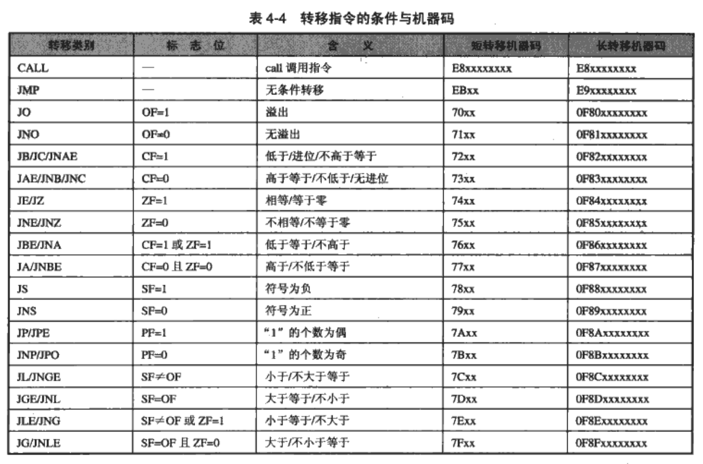

加密与解密 第2篇 调试篇

## 第4章 逆向分析技术

### 4.1 启动函数

- c/c++运行时启动函数作用
  - 检索指向新进程的命令行指针
  - 检索指向新进程的环境变量指针
  - 全局变量初始化
  - 内存堆栈初始化

```asm
00401020 >/$  55            push    ebp
00401021  |.  8BEC          mov     ebp, esp
00401023  |.  6A FF         push    -1
00401025  |.  68 A0504000   push    004050A0
0040102A  |.  68 7C1C4000   push    00401C7C                         ;  SE 处理程序安装
0040102F  |.  64:A1 0000000>mov     eax, dword ptr fs:[0]
00401035  |.  50            push    eax
00401036  |.  64:8925 00000>mov     dword ptr fs:[0], esp
0040103D  |.  83EC 10       sub     esp, 10
00401040  |.  53            push    ebx
00401041  |.  56            push    esi
```

### 4.2 函数

### 4.2.1 函数的识别

- CALL
- RET

### 4.2.2 函数的参数

#### 利用堆栈传递

```asm
00401000 >/$  6A 04         push    4                                ; /Arg2 = 00000004
00401002  |.  6A 03         push    3                                ; |Arg1 = 00000003
00401004  |.  E8 16000000   call    0040101F                         ; \Add.0040101F
00401009  |.  8BD8          mov     ebx, eax
0040100B  |.  6A 00         push    0                                ; /ExitCode = 0
0040100D  \.  FF15 00204000 call    [<&KERNEL32.ExitProcess>]        ; \ExitProcess


0040101F  /$  55            push    ebp                              ;  保护现场原先的EBP指针
00401020  |.  8BEC          mov     ebp, esp                         ;  设置新的EBP指针，指向栈顶
00401022  |.  83EC 04       sub     esp, 4                           ;  分配局部变量所有空间
00401025  |.  8B45 0C       mov     eax, [ebp+C]                     ;  调用参数2
00401028  |.  8B5D 08       mov     ebx, [ebp+8]                     ;  调用参数1
0040102B  |.  895D FC       mov     [ebp-4] , ebx                    ;  参数1放局部变量里
0040102E  |.  0345 FC       add     eax,[ebp-4]                      ;  参数2与局部变量相加
00401031  |.  83C4 04       add     esp, 4                           ;  释放局部变量所有空间
00401034  |.  5D            pop     ebp                              ;  恢复现场的ebp指针
00401035  \.  C2 0800       retn    8
```

- enter/leave

   `enter = push ebp/move ebp,esp/sub esp,xxx`
   `leave = add esp,xxx/pop esp`

  ```asm
  enter xxx,0	;0表示创建xxx放局部变量
  ...
  leave 
  ret 8
  ```

- vc6.0 使用`maximize speed`

  ```asm
  push par2 ;参数2
  push par1 ;参数1
  call test2
  {
   	move eax, dword ptr [esp+04] ;调用参数1
      move ecx, dword ptr [esp+08] ;调用参数2
      ...
      ret 8
  }
  ```

##### 利用寄存器传递变量

- 规范：__fastcall

  ```c
  /*******************************************************
  *  fastcall调用                                                                                                   *
  *   (c)  看雪软件安全网站 www.pediy.com 2000-2008                         *
  ********************************************************/
  
  int  __fastcall Add(char,long,int,int);
  
  main(void)
   {
  	    Add(1,2,3,4);
  	    return 0;
   }
  
  int __fastcall Add(char a, long b, int c, int d)
  
  {
  	   return (a + b + c + d);
  }
  
  ```

  vc编译： `optimizations:default`

##### 名称修饰约定

- name mangling/name decoration
- 同一名字具有不同的参数或者不同的作用域
- c编译时函数名修饰约定规则：
  - \__stdcall调用约定：\_{functionname}@{byte_number}
  - \_cdel调用约定：_{functionname}
  - __fastcall调用约定：@{functionname}@{byte_number}

#### 4.2.3 函数的返回值

##### 0x1 用return返回

##### 0x2 通过参数按引用方式返回

### 4.3 数据结构

#### 4.3.1 局部变量

1. 利用堆栈

   - `sub esp,8`

   - 调用格式：

     - 局部：[ebp-xxxx]
     - 参数调用：[ebp+xxxx]

   - 局部变量与清除堆栈的几种形式

     | 形式一                         | 形式二                     | 形式三                |
     | ------------------------------ | -------------------------- | --------------------- |
     | sub esp,n<br /><br />add esp,n | add esp,-n<br />sub esp,-n | push reg<br />pop reg |

   - 局部变量初始化

     - mov [ebp-04],5
     - push 5

2. 利用寄存器

   除了堆栈占用2个寄存器外，编译器会利用剩下的6个通用寄存器

#### 4.3.2 全局变量

- 位于.data段中

- 格式：

  ```asm
  move eax,dword ptr [4084c0h]
  ```

- 作用：

  1. 传递参数
  2. 传递函数返回值

- 示例

  ```c
  /*******************************************************
  《加密与解密》第三版配套实例
                                        4.3.2  全局变量
  (c)  看雪软件安全网站 www.pediy.com 2000-2008
  ********************************************************/
  int z;
  
  int add(int x,int y);
  int main(void)
   {
  	 int a=5,b=6;
  	 z=7;
  	 add(a,b);
  	 return 0;
   }
  
   int add(int x,int y)
   {
  	 return(x+y+z);
   }
  ```

  vc++6.0编译，选择不优化

- 与静态变量类似，但静态变量只在定义这些变量的函数内有效

#### 4.3.3  数组

- 实现方式：基址+变量

- 示例：

  ```c
  /*******************************************************
  《加密与解密》第三版配套实例
                                        4.3.3 数组
  (c)  看雪软件安全网站 www.pediy.com 2000-2008
  ********************************************************/
  
  #include <stdio.h>
  
  int main(void)
  {
  	static int a[3]={0x11,0x22,0x33};
      int i,s=0,b[3];
  	for(i=0;i<3;i++)
  	{ 
  		s=s+a[i];
  		b[i]=s;
  	}
  	
  	for(i=0;i<3;i++)
  	{
  		printf("%d\n",b[i]);
  	}
  	
  	return 0;
  }
  
  ```

  编译优化选项：最快速度，但是我build出现了错误：

  > Command line error D2016 : '/O2' and '/GZ' command-line options are incompatible
  > 执行 cl.exe 时出错.

  - /GZ 可以帮助捕获内存错误 
  - /O1 或 /O2 优化开关，使程序最小或最快 

  既然两个选项不兼容，那么就把/GZ去掉，编译成功 :happy:

- sample

  ```asm
  mov eax,[407030h+eax]
  ```

- 数组存在位置

  1. 堆栈
  2. 数据段 .data
  3. 动态内存

- 间接寻址一般出现在：

  1. 数组
  2. 结构赋值

- [基址+寄存器]

  - 基址可以为常量或者是寄存器

### 4.4  虚函数 

- 虚函数的地址：在调用之前加以确定

- 虚函数表（Virtual Table，VTBL）：存放虚函数的引用

- 虚函数表指针（Virtual Table Pointer,VPTR）:指向对象中的函数

- 示例：

  ```c
  /*******************************************************
  《加密与解密》第三版配套实例
                                      4.4 虚函数
  (c)  看雪软件安全网站 www.pediy.com 2000-2008
  ********************************************************/
  
  #include <stdio.h>
  class CSum
  {
  public:
  	virtual int Add(int a, int b) 
  	{
  		return (a + b);
  	}
  
  	virtual	int	Sub(int a, int b )
  	{
  		return (a - b);
  	}
  
  };
  
  void main()
  {   
  	CSum*	pCSum = new CSum ;  
  
  	pCSum->Add(1,2);
  	pCSum->Sub(1,2);
  
  
  } 
  
  ```

  汇编代码：

  ```asm
  00401030 > > \56            push esi
  00401031   .  6A 04         push 0x4
  00401033   .  E8 88000000   call Calling_.operator new
  00401038   .  83C4 04       add esp,0x4
  0040103B   .  85C0          test eax,eax
  0040103D   .  74 0A         je XCalling_.00401049
  0040103F   .  C700 1C204100 mov dword ptr ds:[eax],offset Calling_.C>
  00401045   .  8BF0          mov esi,eax
  00401047   .  EB 02         jmp XCalling_.0040104B
  00401049   >  33F6          xor esi,esi
  0040104B   >  8B06          mov eax,dword ptr ds:[esi]
  0040104D   .  6A 02         push 0x2
  0040104F   .  6A 01         push 0x1
  00401051   .  8BCE          mov ecx,esi
  00401053   .  FF10          call dword ptr ds:[eax]
  00401055   .  8B16          mov edx,dword ptr ds:[esi]
  00401057   .  6A 02         push 0x2
  00401059   .  6A 01         push 0x1
  0040105B   .  8BCE          mov ecx,esi
  0040105D   .  FF52 04       call dword ptr ds:[edx+0x4]
  00401060   .  5E            pop esi
  00401061   .  C3            retn
  ```

  `mov ecx,esi`中，ecx保存了 ==this指针==，但是从汇编代码上看，没看出this指针的作用

  vtbl中的数据：

  ```
  0041201C >05 10 40 00 0F 10 40 00  @.@.
  ```

  add函数：

  ```asm
  00401080 > > \8B4424 08     mov eax,dword ptr ss:[esp+0x8]
  00401084   .  8B4C24 04     mov ecx,dword ptr ss:[esp+0x4]
  00401088   .  03C1          add eax,ecx
  0040108A   .  C2 0800       retn 0x8
  ```

  sub函数：

  ```asm
  004010A0 > > \8B4424 04     mov eax,dword ptr ss:[esp+0x4]
  004010A4   .  8B4C24 08     mov ecx,dword ptr ss:[esp+0x8]
  004010A8   .  2BC1          sub eax,ecx
  004010AA   .  C2 0800       retn 0x8
  ```


### 4.5  控制语句

#### 4.5.1  IF-THEN-ELSE语句 

- 汇编代码

  - 整数

    - cmp 

      `a-b`的结果，影响ZF/进位/符号位/溢出标志

      ```asm
      cmp a,b
      jz（jnz） xxxx
      ```

    - test

      `a &&b` a和b逻辑与的结果，结果为0，ZF置1

    - or

```asm
00401010   push        ecx
11:        int a,b=5;
12:   scanf("%d",&a);
00401011   lea         eax,[esp]
00401015   push        eax
00401016   push        offset string "%d" (00416a30)
0040101B   call        scanf (00401050)
13:        if(a==0)
00401020   mov         eax,dword ptr [esp+8]
00401024   add         esp,8
00401027   test        eax,eax
00401029   jne         main+20h (00401030)
14:            a=8;
0040102B   mov         eax,8
15:
16:
17:        return a+b;
00401030   add         eax,5
18:    }
00401033   pop         ecx
00401034   ret

```

#### 4.5.2  SWITCH-CASE语句

- 没有优化的情况下，编译：

```asm
00401010   push        ebp
00401011   mov         ebp,esp
00401013   sub         esp,8
00401016   mov         dword ptr [ebp-8],0CCCCCCCCh
0040101D   mov         dword ptr [ebp-4],0CCCCCCCCh
11:        int a;
12:        scanf("%d",&a);
00401024   lea         eax,[a]
00401027   push        eax
00401028   push        offset ___xt_z+104h (00417a30)
0040102D   call        scanf (00401140)
00401032   add         esp,8
13:
14:        switch(a)
15:        {
00401035   mov         ecx,dword ptr [a]
00401038   mov         dword ptr [ebp-8],ecx
0040103B   cmp         dword ptr [ebp-8],1	;case 1
0040103F   je          main+3Fh (0040104f)	
00401041   cmp         dword ptr [ebp-8],2	;case 2
00401045   je          main+4Eh (0040105e)
00401047   cmp         dword ptr [ebp-8],0Ah	;case 10
0040104B   je          main+5Dh (0040106d)
0040104D   jmp         main+6Ch (0040107c)
16:           case 1 :printf("a=1");
0040104F   push        offset ___xt_z+108h (00417a34)
00401054   call        printf (004010c0)
00401059   add         esp,4
17:                       break;
0040105C   jmp         main+79h (00401089)
18:           case 2 :printf("a=2");
0040105E   push        offset ___xt_z+10Ch (00417a38)
00401063   call        printf (004010c0)
00401068   add         esp,4
19:                       break;
0040106B   jmp         main+79h (00401089)
20:           case 10:printf("a=10");
0040106D   push        offset ___xt_z+110h (00417a3c)
00401072   call        printf (004010c0)
00401077   add         esp,4
21:                       break;
0040107A   jmp         main+79h (00401089)
22:           default :printf("a=default");
0040107C   push        offset ___xt_z+118h (00417a44)
00401081   call        printf (004010c0)
00401086   add         esp,4
23:                        break;
24:        }
25:
26:        return 0;
00401089   xor         eax,eax
```

- 设置了最大速度的情况下，编译：

```asm
9:    int main(void)
10:    {
0040F9A0   push        ecx	;为局部变量分配内存，相当于sub esp,4
11:        int a;
12:        scanf("%d",&a);
0040F9A1   lea         eax,[esp]
0040F9A5   push        eax
0040F9A6   push        offset string "%d" (00417d1c)
0040F9AB   call        scanf (00401140)
13:
14:        switch(a)
15:        {
0040F9B0   mov         eax,dword ptr [esp+8]
0040F9B4   add         esp,8
0040F9B7   dec         eax	;检查eax是否为1，如果是，下一句就跳转
0040F9B8   je          main+55h (0040f9f5)	;相当于case 1
0040F9BA   dec         eax	;eax再减1，即原来的eax是2
0040F9BB   je          main+44h (0040f9e4)	;相当于 case 2
0040F9BD   sub         eax,8				;原来的值为10
0040F9C0   je          main+33h (0040f9d3)	;case 10
21:                       break;
22:           default :printf("a=default");
0040F9C2   push        offset string "a=default" (0041a358)
0040F9C7   call        printf (004010c0)
0040F9CC   add         esp,4
23:                        break;
24:        }
25:
26:        return 0;
0040F9CF   xor         eax,eax
27:    }
0040F9D1   pop         ecx
0040F9D2   ret
19:                       break;
20:           case 10:printf("a=10");
0040F9D3   push        offset string "a=10" (00417e94)
0040F9D8   call        printf (004010c0)
0040F9DD   add         esp,4
23:                        break;
24:        }
25:
26:        return 0;
0040F9E0   xor         eax,eax
27:    }
0040F9E2   pop         ecx
0040F9E3   ret
17:                       break;
18:           case 2 :printf("a=2");
0040F9E4   push        offset string "a=2" (00417a64)
0040F9E9   call        printf (004010c0)
0040F9EE   add         esp,4
23:                        break;
24:        }
25:
26:        return 0;
0040F9F1   xor         eax,eax
27:    }
0040F9F3   pop         ecx
0040F9F4   ret
16:           case 1 :printf("a=1");
0040F9F5   push        offset string "a=1" (00417a50)
0040F9FA   call        printf (004010c0)
0040F9FF   add         esp,4
23:                        break;
24:        }
25:
26:        return 0;
0040FA02   xor         eax,eax
27:    }
0040FA04   pop         ecx
0040FA05   ret

```

- 当case取值表示一个算术级数，编译器会利用一个跳转表来实现

  注：使用vc6.0调试，产生的调试信息，但是有一处注释有明显的问题，`case 1`下面是没有defualt语句的，但是vc的注释却显示了`default :printf("a=default");`，这里需要注意

```asm
   int main(void)
11:    {
00401010 51                   push        ecx
12:        int a;
13:        scanf("%d",&a);
00401011 8D 44 24 00          lea         eax,[esp]
00401015 50                   push        eax
00401016 68 58 7A 41 00       push        offset string "%d" (00417a58)
0040101B E8 80 01 00 00       call        scanf (004011a0)
14:
15:        switch(a)
16:        {
00401020 8B 4C 24 08          mov         ecx,dword ptr [esp+8]
00401024 83 C4 08             add         esp,8
00401027 8D 41 FF             lea         eax,[ecx-1]
0040102A 83 F8 06             cmp         eax,6	;判断是否为default节点
0040102D 77 7E                ja          $L545+11h (004010ad)
0040102F FF 24 85 C0 10 40 00 jmp         dword ptr [eax*4+4010C0h]	;跳转表
17:           case 1 :printf("a=1");
00401036 68 54 7A 41 00       push        offset string "a=1" (00417a54)
30:                       break;
31:
32:           default :printf("a=default");
0040103B E8 E0 00 00 00       call        printf (00401120)
00401040 83 C4 04             add         esp,4
33:                        break;
34:        }
35:
36:        return 0;
00401043 33 C0                xor         eax,eax
37:    }
00401045 59                   pop         ecx
00401046 C3                   ret
18:                       break;
19:           case 2 :printf("a=2");
00401047 68 50 7A 41 00       push        offset string "a=2" (00417a50)
30:                       break;
31:
32:           default :printf("a=default");
0040104C E8 CF 00 00 00       call        printf (00401120)
00401051 83 C4 04             add         esp,4
33:                        break;
34:        }
35:
36:        return 0;
00401054 33 C0                xor         eax,eax
37:    }
00401056 59                   pop         ecx
00401057 C3                   ret
20:                       break;
...//省略掉类似的内容
31:
32:           default :printf("a=default");
004010AD 68 30 7A 41 00       push        offset string "a=default" (00417a30)
004010B2 E8 69 00 00 00       call        printf (00401120)
004010B7 83 C4 04             add         esp,4
33:                        break;
34:        }
35:
36:        return 0;
004010BA 33 C0                xor         eax,eax
37:    }
004010BC 59                   pop         ecx
004010BD C3                   ret
004010BE 8B FF                mov         edi,edi
004010C0 36 10 40 00          adc         byte ptr ss:[eax],al
004010C4 47                   inc         edi
004010C5 10 40 00             adc         byte ptr [eax],al
004010C8 58                   pop         eax
004010C9 10 40 00             adc         byte ptr [eax],al
004010CC 69 10 40 00 7A 10    imul        edx,dword ptr [eax],107A0040h
004010D2 40                   inc         eax
004010D3 00 8B 10 40 00 9C    add         byte ptr [ebx-63FFBFF0h],cl
004010D9 10 40 00             adc         byte ptr [eax],al
```


#### 4.5.3  转移指令机器码的计算 



#### 4.5.4  条件设置指令（SETcc） 91

#### 4.5.5  纯算法实现逻辑判断 92

#### 4.6  循环语句 93

#### 4.7  数学运算符 94

##### 4.7.1  整数的加法和减法 94

##### 4.7.2  整数的乘法 94

##### 4.7.3  整数的除法 95

#### 4.8  文本字符串 97

##### 4.8.1  字符串存储格式 97

##### 4.8.2  字符寻址指令 98

##### 4.8.3  字母大小写转换 98

##### 4.8.4  计算字符串的长度 99

# 4.9  指令修改技巧 99