# whale-大筛子

题目：

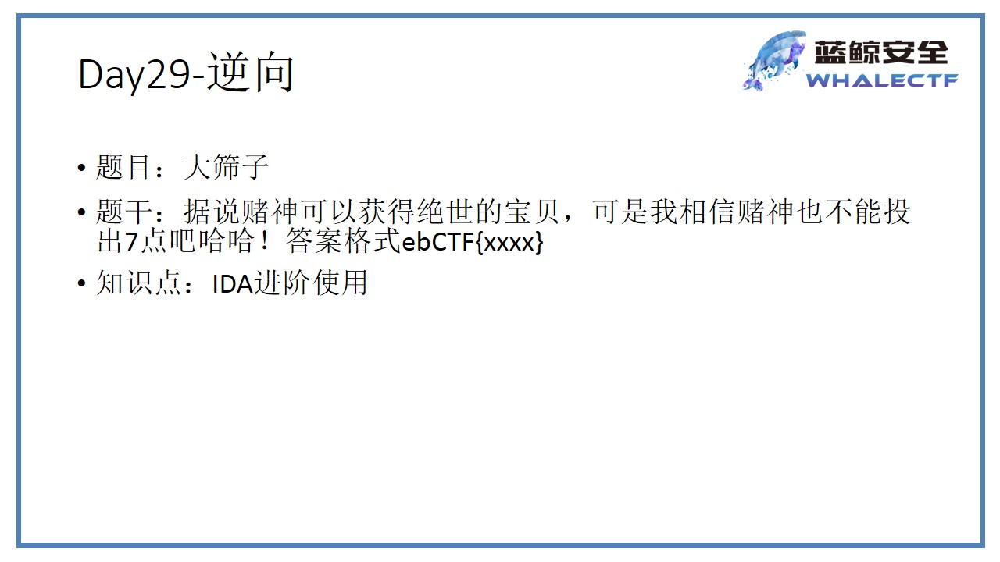 

## 0x01 解题步骤

### 0x1 方法1 静态分析

##### 0x01 DIE分析

​	分析dice.exe，发现是32位程序，用32位IDA打开

##### 0x02 找到flag输入语句

1. 找入口点

- winMain()
- shift+F12找感兴趣的字符串

2. 找到感兴趣的字符串，双击进入

3. 查看交叉引用，双击到winMain函数里

4. 确定flag的输出语句

   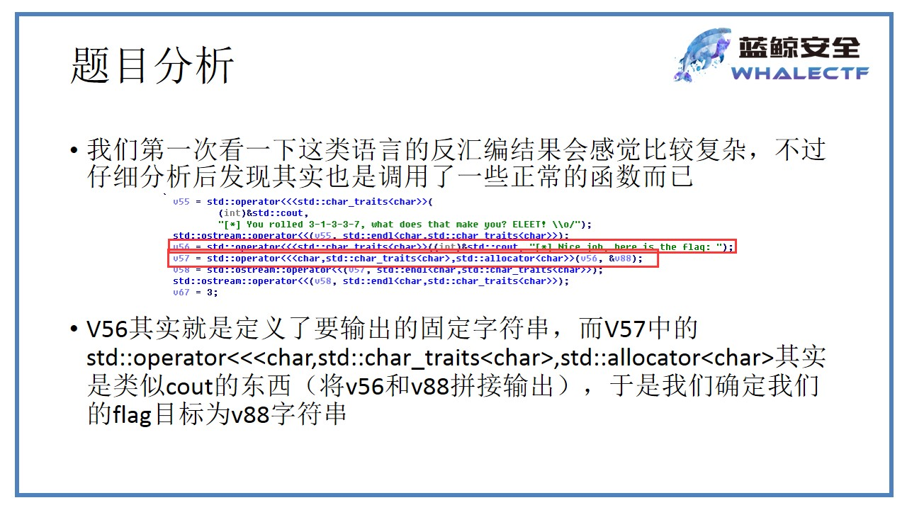


#####  0x3`alt+t`搜索v88的位置

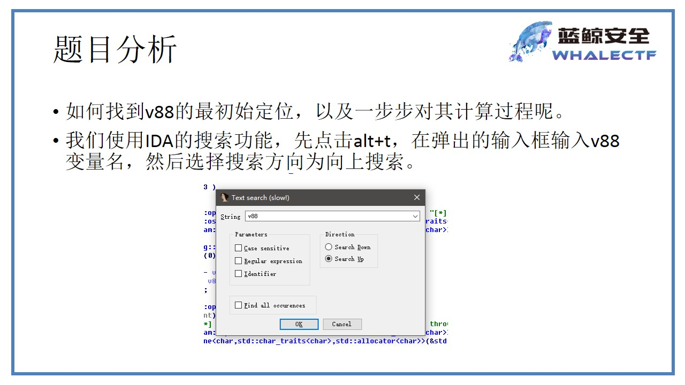

##### 0x4 找到v88赋值的地方

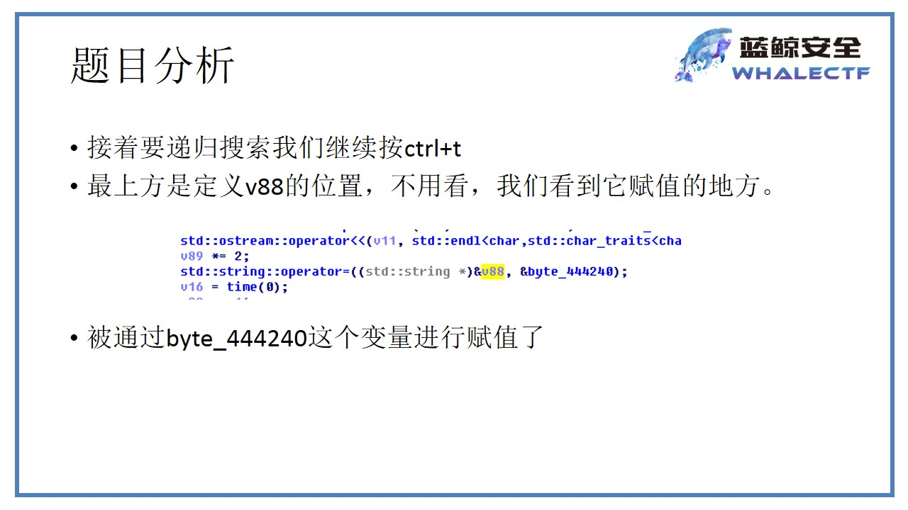 

##### 0x5 变量导出

 双击变量，把byte_444240处的变量导出（shift+e）

**注意：不能把结尾的00也复制出来**

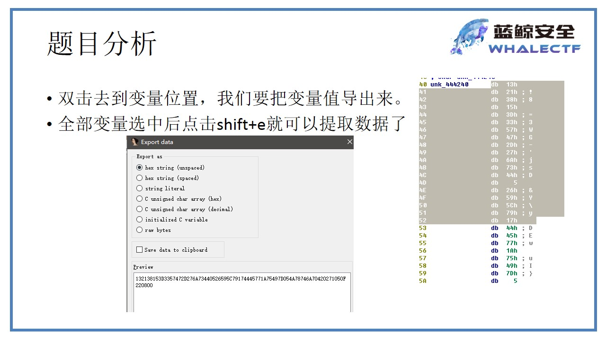 

##### 0x6 查看v88的变化

找到最后一句检测v88的语句

 

##### 0x7 查看v99，并导出

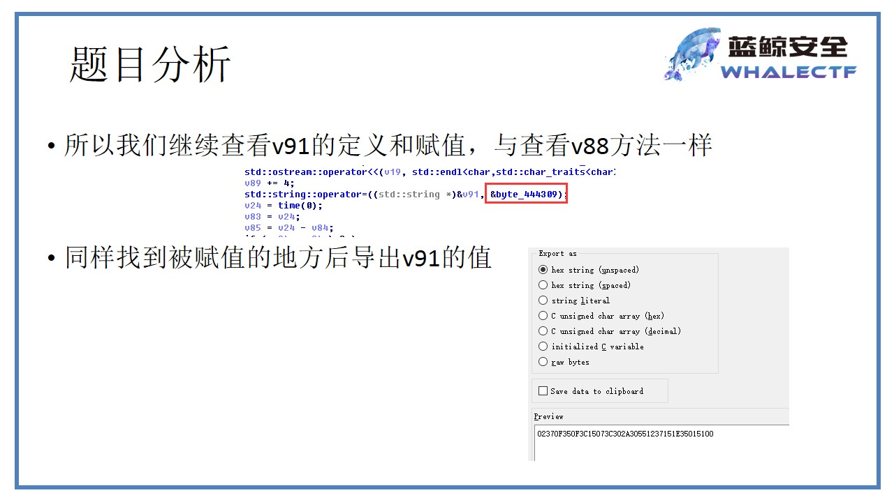 

##### 0x8 再次跟踪v89和v90的变化

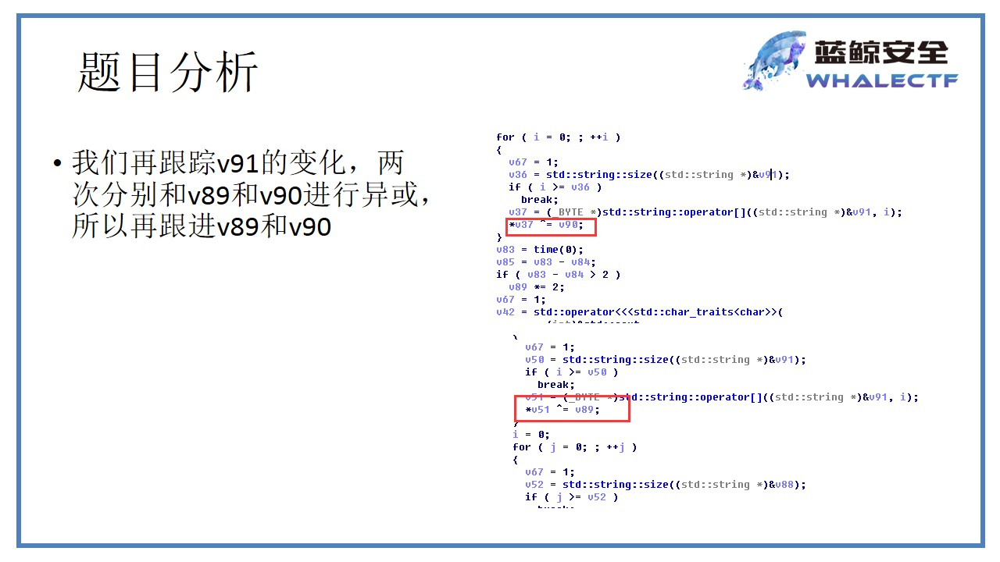 

##### 0x9 v89的变化

**反调试：time()函数计算延时大小**

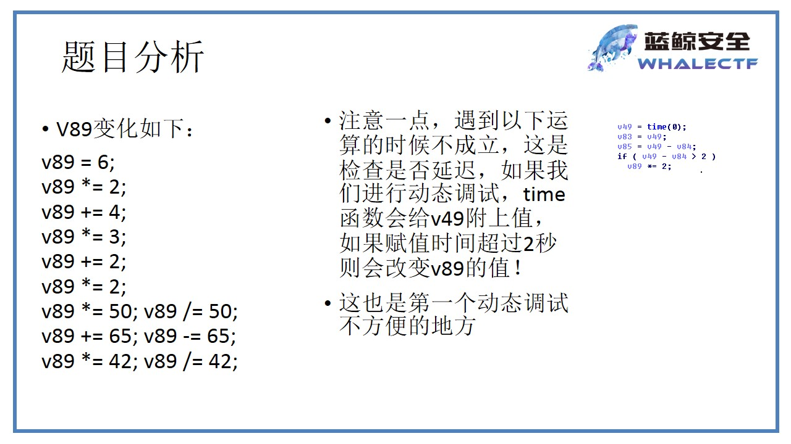 

##### 0x10 V90的变化

**反调试技巧：idDebuggerPresent()**

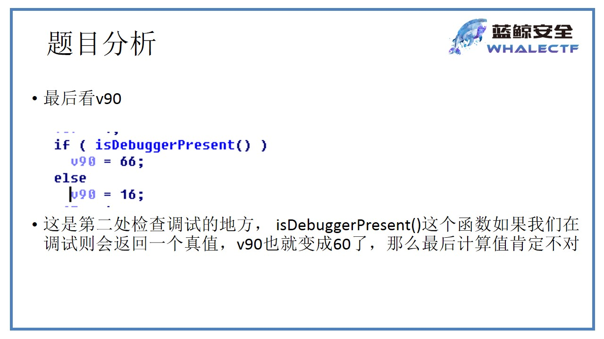 

##### 0x11 利用python给出结果

- 反汇编部分源代码

```c
            for ( j = 0; ; ++j )
            {
              v67 = 1;
              v52 = std::string::size((std::string *)&v88);
              if ( j >= v52 )
                break;
              v64 = (_BYTE *)std::string::operator[]((std::string *)&v88, j);
              v53 = (_BYTE *)std::string::operator[]((std::string *)&v91, i);
              *v64 ^= *v53;
              ++i;
              v54 = std::string::length((std::string *)&v91);
              if ( i >= v54 )
                i = 0;
            }
```

- python

```python
# -*- coding:utf-8 -*-
def foo():
    v89,v90=100,16
    v91="02370F350F3C15073C302A30551237151E350151"
    v88="132138153D3357472D276A73440526595C79174445771A75497D054A78746A70420271050F2208"
    v91=[ord(i) for i in v91.decode('hex')]
    for i in xrange(len(v91)):
        v91[i]^=v89^v90
    v88=[ord(i) for i in v88.decode('hex')]
    res=""
    for i in xrange(len(v88)):
        res+=chr(v88[i]^v91[i%len(v91)])
    print res
    pass
if __name__ == '__main__':
  foo()
  print 'ok'

```


###  0x2 方法2 IDA流程图法

1. 程序使用cmp指令来对比骰子的点数是否与规定的一致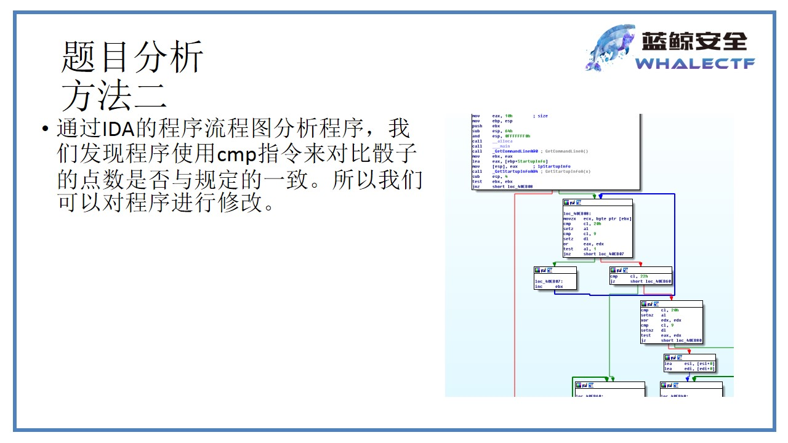 

2. 程序通过判断`[ebp+var_5c]`中的值是否为3进行跳转

   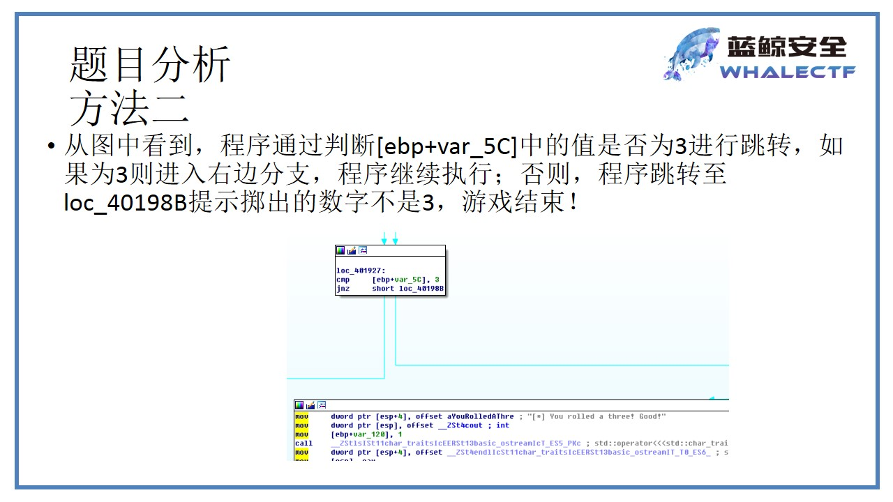 

3. 通过修改跳转指令来增大成功几率将`jnz`替换为`jz`

   修改方法：options/general/disassemly/number of opcode bytes设置为16，使其显示指令的机器码

   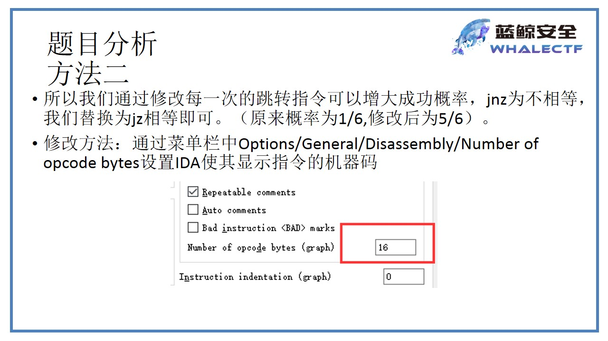 

4. JNZ的机器码为：75，修改为74（JZ）

   修改方法：Eidt/Patch program/change byte

   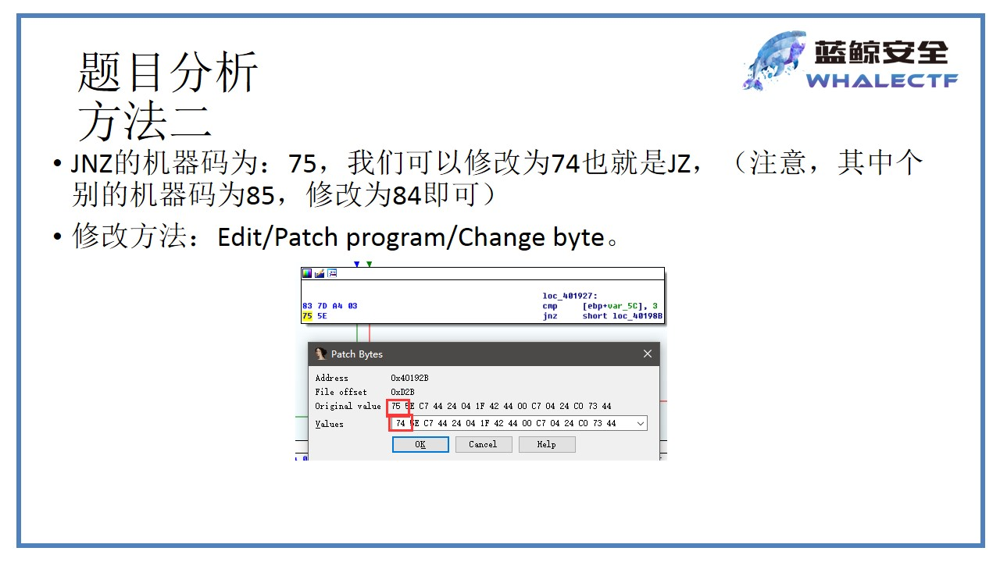 

5. 依次将几个判断都修改掉，然后保存修改

   方法：`edit/patch program/apply patches to input file`

   注意：**得保存项目**

   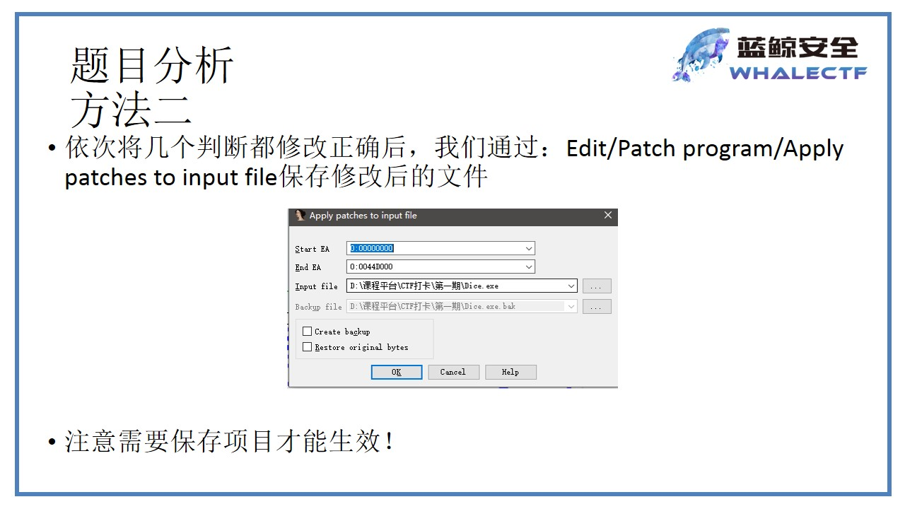 

6. 运行得到flag