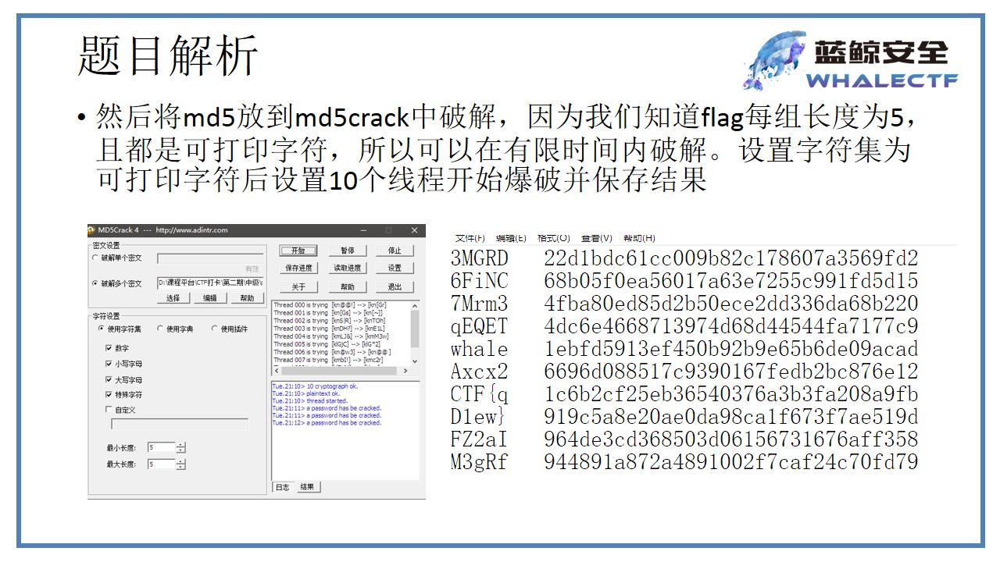

# py逆向1

## 0x1 题目

 

## 0x2 解题步骤

### 0x1 反编译umVm.pyc

- 使用eay python decomplier

### 0x2 爆破md5

#### 0x1 反编译后的文件

```python
# Embedded file name: unVm.py
import md5
md5s = [40872900234340200352311496849171786925L,
 37774871274387226911544626909853297147L,
 136364329640288194110852557127415197202L,
 197102543045186090881257886713375686009L,
 46282790971609926574181364879232245714L,
 199788626591470902691740865303843697496L,
 139155483798021197733301619201494834453L,
 105977393849615850942572250680575701536L,
 103383262965894787541607484291344857033L,
 193549894376121578282270539756256252317L]
print 'Can you turn me back to python ? ...'
flag = raw_input('well as you wish.. what is the flag: ')
if len(flag) > 50:
    print 'nice try'
    exit()
if len(flag) % 5 != 0:
    print 'nice try'
    exit()
for i in range(0, len(flag), 5):
    s = flag[i:i + 5]
    if int('0x' + md5.new(s).hexdigest(), 16) != md5s[i / 5]:
        print 'nice try'
        exit()

print 'Congratz now you have the flag'
```

#### 0x2 转码md5s为16位

```python
md5s = [40872900234340200352311496849171786925,
 37774871274387226911544626909853297147,
 136364329640288194110852557127415197202,
 197102543045186090881257886713375686009,
 46282790971609926574181364879232245714,
 199788626591470902691740865303843697496,
 139155483798021197733301619201494834453,
 105977393849615850942572250680575701536,
 103383262965894787541607484291344857033,
 193549894376121578282270539756256252317]

for i in md5s:
    print('{:032x}'.format(i))
```

输出：

> 1ebfd5913ef450b92b9e65b6de09acad
> 1c6b2cf25eb36540376a3b3fa208a9fb
> 6696d088517c9390167fedb2bc876e12
> 944891a872a4891002f7caf24c70fd79
> 22d1bdc61cc009b82c178607a3569fd2
> 964de3cd368503d06156731676aff358
> 68b05f0ea56017a63e7255c991fd5d15
> 4fba80ed85d2b50ece2dd336da68b220
> 4dc6e4668713974d68d44544fa7177c9
> 919c5a8e20ae0da98ca1f673f7ae519d

#### 0x3 爆破

1. 使用md5crack，设置线程数为10，同时设置字符数为5，字符类型包括所有，设定保存文件位置及文件名

    

2. 得到的明文和md5值的对应关系，手动调整顺序，得到flag