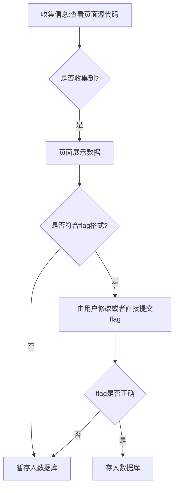

# web2

## 题目

> http://ctf.bugku.com/challenges#web2
>
> 听说聪明的人都能找到答案<http://120.24.86.145:8002/web2/> 


## 解答思路
- 查看页面源代码，获取隐藏信息

  

## 流程图



## 解题步骤

1. 查看源代码 ，查看隐藏信息

   ```javascript
   <!flag KEY{Web-2-bugKssNNikls9100}>
   ```

   


## 漏洞挖掘思路

- 无

## 自动化解析

- TODO

- 判断题目特征：`web` `php` `md5` 
- 设定题目难度等级`level`为simple
- 提交相应符合要求的字符串

