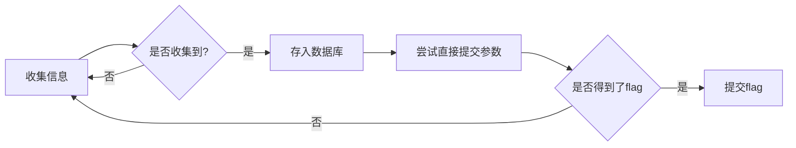

# 后台登录

## 题目

> http://ctf5.shiyanbar.com/web/houtai/ffifdyop.php
>
> 请用管理员密码进行登录~~


## 解答思路
- 从页面收集的信息需要尝试直接提交

- 此题目在源代码中给出了php代码，但其实是干扰项，为了防止入坑，需要优先提交收集到的信息

  ```php+HTML
  
  <!DOCTYPE html>
  <?php
  	 $password=$_POST['password'];
  	$sql = "SELECT * FROM admin WHERE username = 'admin' and password = '".md5($password,true)."'";
  	$result=mysqli_query($link,$sql);
  		if(mysqli_num_rows($result)>0){
  			echo 'flag is :'.$flag;
  		}
  		else{
  			echo '密码错误!';
  		} 
  ?>
  ```
## 流程图



## 解题步骤

1. 获取url的php页面名称`ffifdyop`，提交


## 漏洞挖掘思路

- 无

## 自动化解析

- TODO

- 判断题目特征：`web` `php` `md5` 
- 设定题目难度等级`level`为simple
- 提交相应符合要求的字符串

