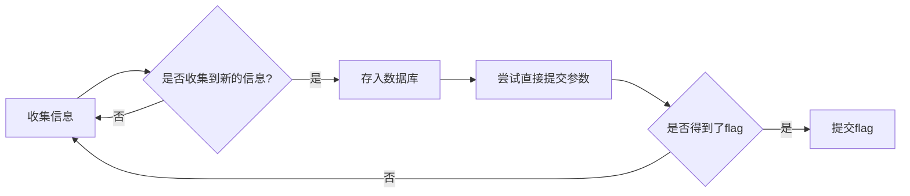

# WEB总结

## 题目类型

### sql注入

`sql注入` `宽字节注入` `)匹配` `htmlentities绕过` `嵌套双重绕过` `重复绕过` `sqlmap` 

#### 代码审计

`代码审计` `php代码审计` `php绕过` `php弱类型比较` `php逻辑漏洞` `php函数漏洞` `php代码运行` `变量覆盖`

#### 文件包含

`文件包含` `php本地包含` 

#### http绕过

`http绕过` `cookie绕过` `Referer绕过` `useragent绕过`

#### 信息收集

`信息收集` `源代码查看` `响应头查看` `目录遍历` `异常script包含` `文件或地址访问` `信息联想` `url地址信息提取`

#### 上传漏洞

`上传漏洞` `0x00截断` `content-type` `filename` 

#### javascript

`javascript` `aaencode` `jsfuck`

#### 访问控制

`访问控制` `maxlength` 

#### web木马

`web木马` `php一句话`

#### 中间件漏洞

`中间件漏洞` `apache伪静态`

## 流程

### 收集信息

### 提交数据

### 提交flag

##流程图

